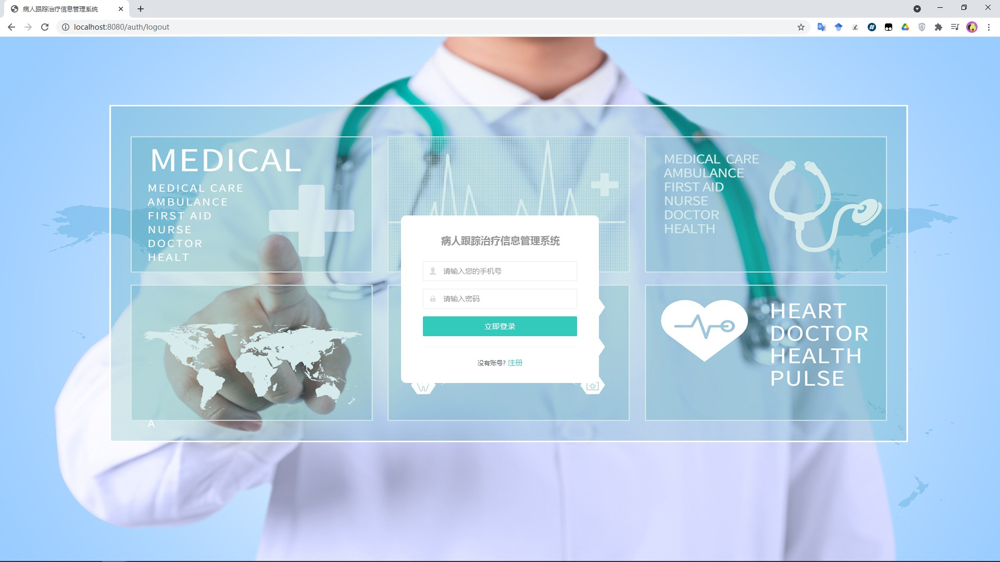
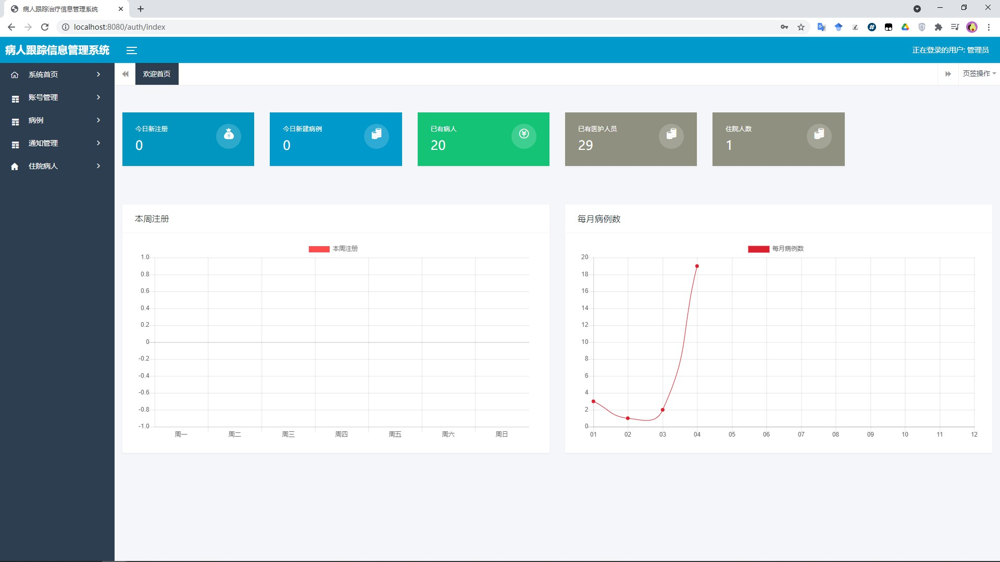
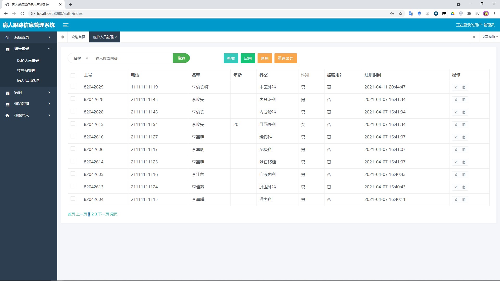
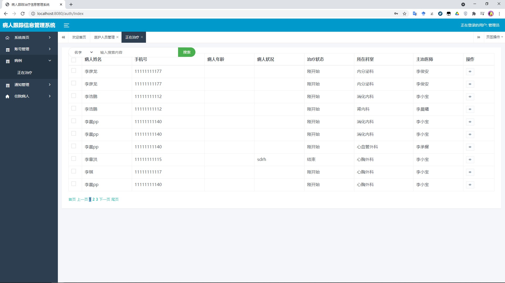
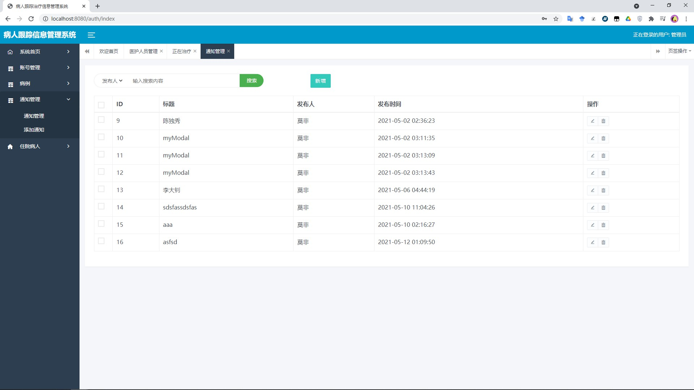
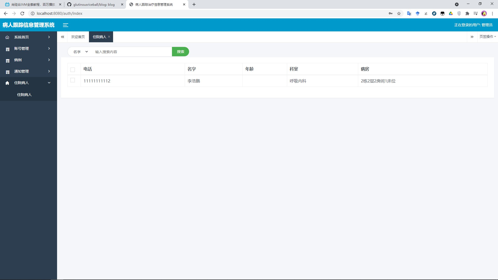

# softwareout

## 平台简介

基于SpringBoot的病人跟踪治疗信息管理系统

使用技术：

后端

- springboot
- mybatis
- shiro
- redis
- websocket

前端：

- bootstrap

## 内置功能

1.  账号管理：用户是系统操作者，该功能主要完成系统用户配置
2.  病例管理：对病例进行增删改查
3.  通知管理：配置通知消息
4.  住院信息管理：对病人的住院信息进行管理

## 演示图

<table>
    <tr>
        <td></td>
        <td></td>
    </tr>
    <tr>
        <td></td>
        <td></td>
    </tr>
     <tr>
        <td></td>
        <td></td>
    </tr>

</table>